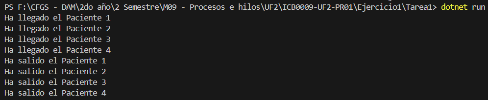
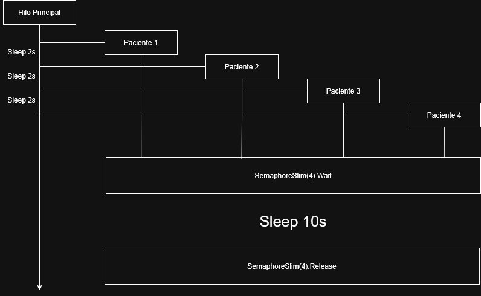

# Ejercicio 1 – Consulta Médica – Tarea 1

## **Propósito del Proyecto**
Este proyecto simula la llegada de 4 pacientes a un hospital y su atención médica en consultas disponibles. Utilizando un semáforo con 4 permisos, cada médico atiende a un paciente de forma individual. Los pacientes llegan con un intervalo de 2 segundos entre ellos, y cada consulta médica tiene una duración de 10 segundos.

El código demuestra cómo gestionar **procesos concurrentes** mediante la clase `SemaphoreSlim` en C#, garantizando que no haya más de 4 pacientes atendidos simultáneamente y manejando la sincronización de recursos.

---

## **Especificaciones del Código**
1. **Llegada de Pacientes:**
   - Se utiliza un hilo (`Thread`) para cada uno de los 4 pacientes.
   - Los hilos simulan pacientes que llegan al hospital con un intervalo de 2 segundos.

2. **Atención Médica:**
   - Se utiliza un objeto `SemaphoreSlim` inicializado con un valor de 4 para representar los 4 médicos disponibles.
   - Si un médico está ocupado, los pacientes esperan su turno.

3. **Duración y Mensajes:**
   - Los pacientes se atienden durante 10 segundos (`Thread.Sleep(10000)`).
   - Se muestran mensajes en la consola indicando la llegada y salida de cada paciente.

---

## **Preguntas y Respuestas**

1. **¿Cuántos hilos se están ejecutando en este programa? Explica tu respuesta.**
   Se ejecutan **5 hilos**:
   - El hilo principal, que coordina y lanza los hilos de los pacientes.
   - 4 hilos adicionales, uno por cada paciente, que ejecutan el método `LlegadaPaciente`.

2. **¿Cuál de los pacientes entra primero en consulta? Explica tu respuesta.**
   El **Paciente 1** es el primero en entrar a consulta, ya que el hilo principal "duerme" 2 segundos entre la inicialización de cada paciente. Esto asegura que los hilos se ejecuten secuencialmente y que el Paciente 1 siempre tenga acceso inmediato a un médico disponible.

3. **¿Cuál de los pacientes sale primero de consulta? Explica tu respuesta.**
   El **Paciente 1** es el primero en salir de consulta, debido a los tiempos secuenciales:
   - Paciente 1: 10 segundos de atención.
   - Paciente 2: 2 segundos para llegar más 10 segundos de atención.
   - Paciente 3: 4 segundos para llegar más 10 segundos de atención.
   - Paciente 4: 6 segundos para llegar más 10 segundos de atención.

---

## **Diagrama del Flujo de Procesos**
El siguiente esquema ilustra cómo funcionan los hilos y el semáforo:

**Nota:** El semáforo (`SemaphoreSlim`) asegura que cada paciente ocupa una consulta disponible y que no haya más de 4 pacientes atendidos simultáneamente.

---

## **Capturas de Pantalla**
### **Ejecución del Programa**

---

## **Esquemas Adicionales**

---
