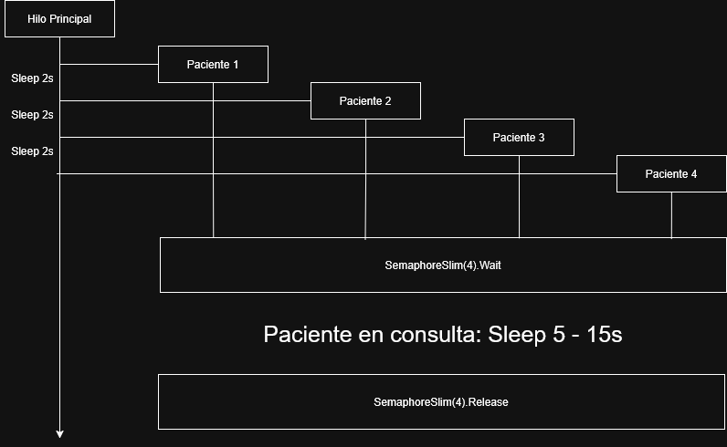

# Ejercicio 1 – Pacientes con datos – Tarea 2

## **Propósito del Proyecto**
Este proyecto amplía la simulación anterior incorporando **datos individuales para cada paciente**. Cada paciente ahora tiene un identificador único, un tiempo de llegada, un tiempo de consulta aleatorio y un estado que cambia conforme avanza en la simulación.

Se emplean estructuras concurrentes en C# (`ConcurrentQueue`, `BlockingCollection` y `SemaphoreSlim`) para gestionar la llegada y la atención de los pacientes, asegurando una ejecución controlada en entornos de **procesamiento concurrente**.

---

## **Especificaciones del Código**
1. **Atributos de los Pacientes:**
   - Cada paciente tiene un **ID único** (número aleatorio del 1 al 100).
   - Un **tiempo de llegada** al hospital (en segundos, desde el inicio de la simulación).
   - Un **tiempo de consulta** aleatorio entre **5 y 15 segundos**.
   - Un **estado** que puede ser:
     - *Espera*: ha llegado al hospital pero aún no ha entrado en consulta.
     - *Consulta*: ha entrado en consulta con un médico.
     - *Finalizado*: ha terminado la consulta.

2. **Manejo de Pacientes:**
   - Se utilizan **4 hilos** para representar a los pacientes.
   - Se controla el acceso mediante un **`SemaphoreSlim`** con 4 permisos.
   - La cola de pacientes es gestionada con **`BlockingCollection`**.

3. **Flujo del Programa:**
   - Cada hilo representa a un médico atendiendo pacientes en orden de llegada.
   - Los pacientes esperan si no hay médicos disponibles.
   - Una vez asignados a consulta, permanecen en ella durante su **tiempo de consulta aleatorio**.
   - Tras finalizar, se muestra un mensaje con todos sus datos.

---

## **Métodos y clases que implementa este proyecto**
1. **Clase `Paciente`**
   - Contiene los atributos: `Id`, `LlegadaHospital`, `TiempoConsulta`, `Estado`, `NumeroLlegada` y `Prioridad`.
   - Se asigna un ID único aleatorio a cada paciente.
   - El tiempo de consulta se genera aleatoriamente entre 5 y 15 segundos.

2. **Método `Consulta()`**
   - Solicita un permiso al `SemaphoreSlim`.
   - Crea un nuevo paciente con los atributos definidos y lo almacena en la `BlockingCollection`.
   - Simula el tiempo de consulta con `Thread.Sleep()`.
   - Libera el permiso del `SemaphoreSlim` y muestra los datos del paciente por consola.

3. **Métodos `NumAleatorio()` y `IdAleatorio()`**
   - Generan valores aleatorios para el tiempo de consulta y el identificador único.

---

## **Preguntas y Respuestas**

1. **¿Cuál de los pacientes sale primero de consulta? Explica tu respuesta.**
   En este caso, la salida de los pacientes de la consulta **es aleatoria**. 
   - Aunque el primer paciente en llegar comienza antes su consulta, su tiempo de atención varía entre 5 y 15 segundos.
   - Un paciente que haya llegado más tarde podría salir antes si su tiempo de consulta es más corto.
   - No hay un orden predefinido de salida, ya que depende de los valores aleatorios generados para cada paciente.

---

## **Capturas de Pantalla**
### **Ejecución del Programa**

---

## **Diagrama de flujo**

---