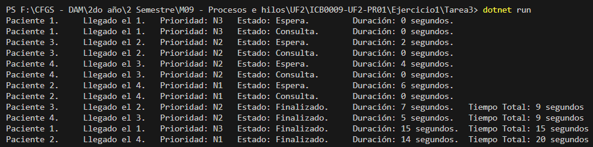

# Ejercicio 1 – Visualización del avance – Tarea 3

## **Propósito del Proyecto**
Este proyecto amplía la simulación previa incorporando la **visualización en consola del estado de cada paciente** en distintos momentos del proceso. Se muestra información detallada de cada paciente, incluyendo el orden de llegada, su estado actual y la duración de cada etapa.

Para lograr esto, se emplean estructuras concurrentes en C# (`ConcurrentQueue`, `BlockingCollection` y `SemaphoreSlim`) junto con `Stopwatch` para medir los tiempos entre los cambios de estado de cada paciente.

---

## **Especificaciones del Código**

### **1. Atributos de los Pacientes:**
- **ID único** (número aleatorio del 1 al 100).
- **Tiempo de llegada** al hospital (segundos desde el inicio de la simulación).
- **Tiempo de consulta** aleatorio entre **5 y 15 segundos**.
- **Orden de llegada** (1 a 4).
- **Estado** que puede ser:
  - *Espera*: ha llegado al hospital pero aún no ha entrado en consulta.
  - *Consulta*: está siendo atendido por un médico.
  - *Finalizado*: ha terminado la consulta.
- **Prioridad** (valor entre 1 y 3, aunque no se usa en esta fase).
- **Tiempo total** (suma de tiempos de espera y consulta).

### **2. Manejo de Pacientes:**
- Se emplean **4 hilos** para representar a los pacientes.
- Se gestiona el acceso mediante un **`SemaphoreSlim`** con 4 permisos.
- Se utiliza **`BlockingCollection`** para manejar la cola de pacientes.
- `Stopwatch` permite calcular el tiempo transcurrido en cada estado.

### **3. Flujo del Programa:**
1. Se generan los pacientes conforme llegan al hospital.
2. Un **cronómetro principal (`Stopwatch`)** mide el tiempo total de la simulación.
3. Cada paciente cambia de estado según el acceso a la consulta.
4. Se muestra en consola la información del paciente en cada cambio de estado.

---

## **Métodos y Clases Implementadas**

### **1. Clase `Paciente`**
Define los atributos del paciente y gestiona su estado durante la simulación:
```csharp
public class Paciente {
    public int Id {get; set;}
    public int TiempoEstados {get; set;}
    public int TiempoConsulta {get; set;}
    public string Estado {get; set;}
    public int NumeroLlegada {get; set;}
    public int Prioridad {get; set;}
    public int TiempoTotal {get; set;}

    public Paciente (int Id, int TiempoEstados, int TiempoConsulta, int NumeroLlegada, int Prioridad) {
        this.Id = Id;
        this.TiempoEstados = TiempoEstados;
        this.TiempoConsulta = TiempoConsulta;
        this.Estado = Program.estados[0];
        this.NumeroLlegada = NumeroLlegada;
        this.Prioridad = Prioridad;
        this.TiempoTotal = TiempoEstados;
    }
}
```

### **2. Método `Consulta()`**
Gestiona el flujo del paciente desde su llegada hasta el final de la consulta:
```csharp
static void Consulta() {
    int TiempoLlegada = (int) MainStopwatch.Elapsed.TotalSeconds;
    Paciente paciente = new(IdAleatorio(), TiempoLlegada, NumAleatorio(5, 15), Llegadas++, NumAleatorio(1, 3));
    Stopwatch ThreadStopwatch = Stopwatch.StartNew();
    MostrarInformacion(paciente);

    SemMedicos.Wait();
    paciente.Estado = estados[1];
    paciente.TiempoEstados = (int) ThreadStopwatch.Elapsed.TotalSeconds;
    paciente.TiempoTotal += paciente.TiempoEstados;
    ThreadStopwatch.Restart();
    MostrarInformacion(paciente);
    Thread.Sleep(paciente.TiempoConsulta * 1000);

    SemMedicos.Release();
    paciente.Estado = estados[2];
    paciente.TiempoEstados = (int) ThreadStopwatch.Elapsed.TotalSeconds;
    paciente.TiempoTotal += paciente.TiempoEstados;
    MostrarInformacion(paciente);
}
```

### **3. Método `MostrarInformacion(Paciente paciente)`**
Muestra los cambios de estado del paciente por consola:
```csharp
private static void MostrarInformacion(Paciente paciente) {
    Console.Write("Paciente {0}. \tLlegado el {1}. \tPrioridad: N{2} \tEstado: {3}. \tDuración: {4} segundos.",
        paciente.Id, paciente.NumeroLlegada, paciente.Prioridad, paciente.Estado, paciente.TiempoEstados);
    
    if(paciente.Estado == estados[2]) 
        Console.WriteLine("\tTiempo Total: {0} segundos", paciente.TiempoTotal);
    else 
        Console.WriteLine();
}
```

---

## **Preguntas y Respuestas**

### **1. ¿Has decidido visualizar información adicional a la planteada en el ejercicio? ¿Por qué?**
Sí. Se ha añadido la **prioridad del paciente** y el **tiempo total transcurrido** desde su llegada hasta el final de la consulta. Aunque la prioridad no influye en este ejercicio, puede ser útil en futuras implementaciones donde los pacientes sean atendidos según su urgencia.

También se ha agregado el **tiempo total** para permitir una mejor evaluación del rendimiento del sistema.

### **2. ¿Qué otra información podría ser útil visualizar?**
- **Tiempo de espera promedio de los pacientes.**
- **Número de pacientes atendidos.**

---

## **Ejemplo de Ejecución en Consola**


---