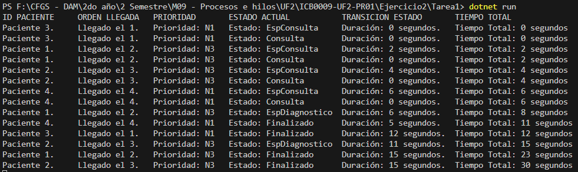

# Ejercicio 2 – Unidades de Diagnóstico – Tarea 1

## **Propósito del Proyecto**
Este proyecto amplía la simulación previa añadiendo la capacidad de **realizar pruebas de diagnóstico** a ciertos pacientes mediante el uso de equipos limitados, como un escáner corporal. Se incorpora un **nuevo flujo de estados** para los pacientes que requieran estas pruebas, asegurando que el acceso a las máquinas se gestione de manera concurrente y eficiente.

El programa simula la lógica en un hospital con:
- **Dos máquinas de diagnóstico**, cada una ocupable por un solo paciente a la vez.
- Un **nuevo atributo en la clase `Paciente`**, llamado `RequiereDiagnostico`, que se genera aleatoriamente para decidir si un paciente necesita pruebas adicionales.

---

## **Especificaciones del Código**

### **1. Atributos y Estados de los Pacientes:**
- **Nuevo atributo:**  
  - `RequiereDiagnostico` (booleano): Determina si el paciente necesita pruebas adicionales (escáner).
- **Estados adicionales del paciente:**
  - *EsperaConsulta*: El paciente ha llegado al hospital pero aún no ha sido atendido.
  - *Consulta*: El paciente está siendo atendido por un médico.
  - *EsperaDiagnostico*: Requiere diagnóstico adicional y está esperando su turno para usar la máquina.
  - *Finalizado*: El paciente ha completado su consulta y las pruebas, si fueran necesarias.

### **2. Gestión de Diagnóstico:**
- Se utiliza un semáforo (`SemaphoreSlim`) inicializado con **2 permisos** para simular el acceso a las máquinas de diagnóstico.
- **Los pacientes acceden por orden de llegada** a la máquina de diagnóstico, garantizando la gestión justa mediante una cola.

### **3. Flujo del Programa:**
1. Los pacientes son creados con atributos generados aleatoriamente, incluido si requieren diagnóstico adicional.
2. Cada paciente pasa primero por consulta, gestionada con otro semáforo que permite hasta **4 consultas simultáneas**.
3. Si el paciente necesita diagnóstico adicional:
   - Cambia al estado *EsperaDiagnostico*.
   - Espera hasta que una máquina esté libre.
   - Ocupa la máquina durante **15 segundos** simulando las pruebas.
4. Finalmente, el paciente pasa al estado *Finalizado* y se registra su información.

---

## **Métodos y Clases Implementadas**

### **1. Clase `Paciente`**
Se ha ampliado la clase `Paciente` con el atributo `RequiereDiagnostico`:
```csharp
public bool RequiereDiagnostico { get; set; }
```
Esto permite determinar si un paciente debe pasar por el diagnóstico adicional.


### **2. Método `Consulta()`**
Gestiona el flujo desde la llegada del paciente hasta la finalización, incluyendo el diagnóstico cuando es necesario:
```csharp
if (paciente.RequiereDiagnostico) {
    paciente.Estado = Estado.EspDiagnostico;
    paciente.TiempoEstados = (int) ThreadStopwatch.Elapsed.TotalSeconds;
    paciente.TiempoTotal += paciente.TiempoEstados;
    ThreadStopwatch.Restart();
    MostrarInformacion(paciente);

    SemDiagnosis.Wait();
    Thread.Sleep(15000);
    SemDiagnosis.Release();
}
```

### **3. Método `MostrarInformacion(Paciente paciente)`**
Actualiza la información en consola, mostrando el nuevo flujo de estados:
```csharp
Console.WriteLine("Paciente {0}. \tLlegado el {1}. \tPrioridad: N{2} \tEstado: {3} \tDuración: {4} segundos. \tTiempo Total: {5} segundos", 
	paciente.Id, paciente.NumeroLlegada, paciente.Prioridad, paciente.Estado, paciente.TiempoEstados, paciente.TiempoTotal);
```

---

## **Preguntas y respuestas**
### 1. ¿Los pacientes que deben esperar para hacerse las pruebas diagnóstico entran luego a hacerse las pruebas por orden de llegada?
Sí, los pacientes entran a las máquinas de diagnóstico en el orden en que llegan a ellas. Esto se gestiona mediante el uso de un semáforo (SemaphoreSlim), que asegura el acceso secuencial a las máquinas.

### 2. ¿Qué pruebas se realizaron para comprobar este comportamiento?
Se configuró el sistema para que todos los pacientes requirieran diagnóstico. Con el uso de mensajes en consola y controles de tiempo, se verificó que:
- Los pacientes que llegan primero son atendidos primero.
- Ningún paciente adelanta a otro en la cola de diagnóstico.

---

## Ejemplo de ejecución en consola
