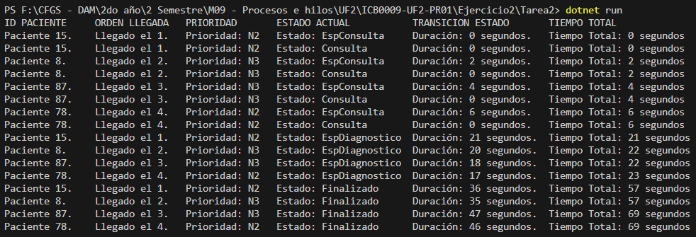
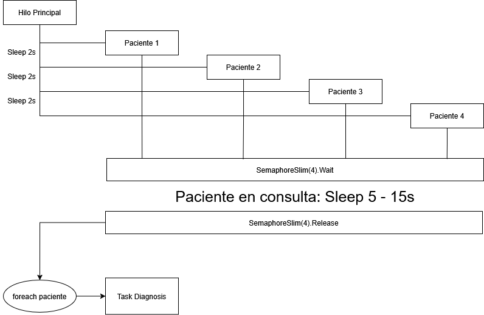

# Ejercicio 2 – Unidades de Diagnóstico – Tarea 2

## **Propósito del Proyecto**
Este proyecto desarrolla el flujo de diagnóstico simulado incorporando una **sincronización específica** que asegura que los pacientes realicen las pruebas diagnósticas en estricto **orden de llegada al hospital**, independientemente del orden de salida de la consulta médica.

Con este objetivo, se gestionan los pacientes mediante una **BlockingCollection** y se procesan secuencialmente en el hilo principal, después de que todos hayan completado la consulta.

---

## **Especificaciones del Código**

### **1. Atributos y Estados de los Pacientes:**
- **Nuevo flujo de ejecución sincronizado:**
  - Los pacientes pasan a diagnóstico en estricto orden de llegada.
  - Se utiliza **BlockingCollection**, que garantiza un comportamiento FIFO (First-In, First-Out).
- **Estados del paciente:**
  - *EsperaConsulta*: El paciente ha llegado al hospital pero aún no ha sido atendido.
  - *Consulta*: El paciente está siendo atendido por un médico.
  - *EsperaDiagnostico*: Ha salido de la consulta y requiere diagnóstico adicional.
  - *Finalizado*: El paciente ha completado su consulta y las pruebas diagnósticas (si eran necesarias).

### **2. Flujo del Programa:**
1. **Hilos para las consultas:**
   - Se crean y ejecutan cuatro hilos, cada uno representando a un paciente pasando por consulta.
   - Una vez el paciente ha completado la consulta, se añade a la **BlockingCollection**.
2. **Sincronización para diagnóstico:**
   - En el `Main`, se utiliza un bucle `foreach` para procesar los pacientes en el orden en que llegaron al hospital.
   - Dentro del bucle, se emplean **Tasks** para gestionar cada paciente y determinar si necesita pruebas diagnósticas.
3. **Control de los recursos:**
   - Un semáforo (`SemaphoreSlim`) inicializado con **2 permisos** asegura que solo dos pacientes puedan utilizar las máquinas de diagnóstico simultáneamente.

---

## **Métodos y Clases Implementadas**

### **1. Clase `Paciente`**
Se utiliza la misma clase que en la tarea anterior con los siguientes atributos clave:
```csharp
public bool RequiereDiagnostico { get; set; }
public int MarcaTiempo { get; set; }
```
El atributo `MarcaTiempo` permite calcular la duración de cada transición de estado.

### **2. Método `Main()`**
El procesamiento de diagnóstico en orden se realiza mediante un bucle foreach que itera sobre la `BlockingCollection`:
```csharp
foreach (Paciente paciente in IntercambioPacientes)
{
    Task.Run(() => {
        if (paciente.RequiereDiagnostico) 
        {
            paciente.Estado = Estado.EspDiagnostico;
            paciente.TiempoEstados = (int) MainStopwatch.Elapsed.TotalSeconds - paciente.MarcaTiempo;
            paciente.TiempoTotal += paciente.TiempoEstados;
            MostrarInformacion(paciente);

            SemDiagnosis.Wait();
            Thread.Sleep(15000); // Simula tiempo de diagnóstico
            SemDiagnosis.Release();
        }

        paciente.Estado = Estado.Finalizado;
        paciente.TiempoEstados = (int) MainStopwatch.Elapsed.TotalSeconds - paciente.MarcaTiempo;
        paciente.TiempoTotal += paciente.TiempoEstados;
        MostrarInformacion(paciente);
    });
}
```

### **3. Método `Consulta()`**
Se gestiona la llegada de los pacientes al hospital y su paso por consulta, utilizando hilos:
```csharp
static void Consulta ()
{
    Paciente paciente = new(IdAleatorio(), (int) MainStopwatch.Elapsed.TotalSeconds, NumAleatorio(5, 15), Llegadas++, NumAleatorio(1, 3));
    IntercambioPacientes.Add(paciente);
    MostrarInformacion(paciente);

    SemMedicos.Wait();
    paciente.Estado = Estado.Consulta;
    paciente.TiempoEstados = (int) MainStopwatch.Elapsed.TotalSeconds - paciente.MarcaTiempo;
    paciente.MarcaTiempo = (int) MainStopwatch.Elapsed.TotalSeconds;
    paciente.TiempoTotal += paciente.TiempoEstados;
    MostrarInformacion(paciente);

    Thread.Sleep(paciente.TiempoConsulta * 1000);
    paciente.RequiereDiagnostico = NumAleatorio(0, 1) != 0;
    SemMedicos.Release();
}
```

---

## Preguntas y respuestas
### 1. Explica la solución planteada en tu código y por qué la has escogido.
La solución utiliza una `BlockingCollection`, que mantiene el orden FIFO, para garantizar que los pacientes accedan a las pruebas diagnósticas en el mismo orden en que llegaron al hospital. Este enfoque es eficiente porque evita bloqueos innecesarios y utiliza bucles secuenciales en el `Main`, lo cual permite el procesamiento ordenado.

### 2. Plantea otra posibilidad de solución a la que has programado.
Otra alternativa podría consistir en emplear una variable global `TurnoActual` que represente el número de llegada del paciente que debe ser procesado. Cada paciente esperaría activamente (con un bucle infinito) hasta que su número de llegada coincida con `TurnoActual`. Este enfoque, sin embargo, consumiría CPU de manera innecesaria, haciéndolo menos eficiente que la solución actual.

---

## Ejemplo de Ejecución en Consola


---

## Diagrama de flujo
Debido a que el flujo de este programa cambia significativamente respecto a los proyectos anteriores, indico a continuación la secuencia que sigue la ejecución de este código:
