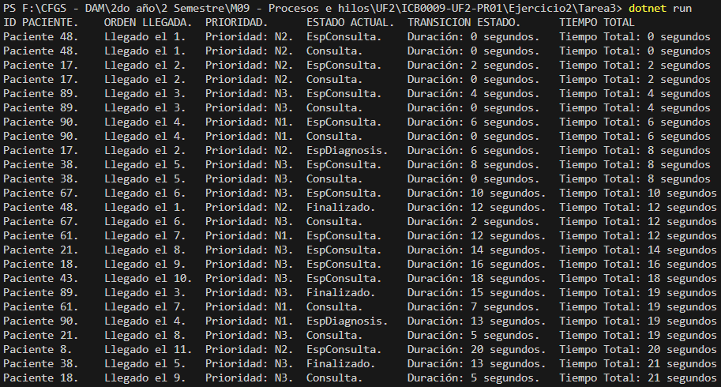

# Ejercicio 2 – Más Pacientes – Tarea 3

## **Propósito del Proyecto**
Este proyecto amplía la simulación previa agregando un total de **20 pacientes** que llegan de manera secuencial al hospital, a intervalos de **2 segundos**. Se mantiene la infraestructura de **4 consultas médicas** y **2 máquinas de diagnóstico**, simulando tiempos de espera en caso de que no haya consultas disponibles.

El objetivo es garantizar un flujo ordenado de pacientes, optimizando el uso de hilos y recursos, al mismo tiempo que se gestiona la concurrencia para las consultas y diagnósticos.

---

## **Especificaciones del Código**

### **1. Atributos y Estados de los Pacientes:**
- **Estados del paciente:**
  - *EsperaConsulta*: El paciente ha llegado al hospital y espera que una consulta quede disponible.
  - *Consulta*: El paciente está siendo atendido por un médico.
  - *EsperaDiagnostico*: El paciente requiere diagnóstico adicional y espera que una máquina esté libre.
  - *Finalizado*: El paciente ha completado todas las etapas del proceso.
- Cada paciente se simula como un hilo independiente que sigue el flujo de llegada, consulta, diagnóstico y salida.

### **2. Flujo de Llegada:**
Los pacientes llegan secuencialmente, uno cada **2 segundos**, gestionados mediante un **bucle `for`** que genera un nuevo hilo en cada iteración:
```csharp
for (int i = 0; i < 20; i++)
{
    Thread TPaciente = new(Consulta);
    TPaciente.Start();
    Thread.Sleep(2000);
}
```

### **3. Gestión de Recursos:**
- **Consultas:** Controladas mediante un semáforo (`SemaphoreSlim`) que permite hasta 4 pacientes en consulta de manera simultánea.
- **Diagnósticos:** Utilizan otro semáforo, configurado con **2 permisos**, para limitar el acceso a las máquinas de diagnóstico.
- Los **semáforos** aseguran que los recursos estén sincronizados y no haya conflictos en su uso.

---

## **Métodos y Clases Implementadas**
### **1. Método `Consulta()`**
Controla el flujo principal del paciente, desde su llegada al hospital hasta el final del diagnóstico (si es necesario):
```csharp
static void Consulta()
{
    Paciente paciente = new(IdAleatorio(), (int) MainStopwatch.Elapsed.TotalSeconds, NumAleatorio(5, 15), Llegadas++, NumAleatorio(1, 3));
    IntercambioPacientes.Add(paciente);
    MostrarInformacion(paciente);

    SemMedicos.Wait();
    paciente.Estado = Estado.Consulta;
    paciente.TiempoEstados = (int) MainStopwatch.Elapsed.TotalSeconds - paciente.MarcaTiempo;
    paciente.MarcaTiempo = (int) MainStopwatch.Elapsed.TotalSeconds;
    paciente.TiempoTotal += paciente.TiempoEstados;
    MostrarInformacion(paciente);
    Thread.Sleep(paciente.TiempoConsulta * 1000);

    paciente.RequiereDiagnostico = NumAleatorio(0, 1) != 0;
    SemMedicos.Release();

    if (paciente.RequiereDiagnostico)
    {
        paciente.Estado = Estado.EspDiagnosis;
        paciente.TiempoEstados = (int) MainStopwatch.Elapsed.TotalSeconds - paciente.MarcaTiempo;
        paciente.TiempoTotal += paciente.TiempoEstados;
        MostrarInformacion(paciente);

        SemDiagnosis.Wait();
        Thread.Sleep(15000);
        SemDiagnosis.Release();
    }

    paciente.Estado = Estado.Finalizado;
    paciente.TiempoEstados = (int) MainStopwatch.Elapsed.TotalSeconds - paciente.MarcaTiempo;
    paciente.TiempoTotal += paciente.TiempoEstados;
    MostrarInformacion(paciente);
}
```

### **2. Método MostrarInformacion(Paciente paciente)**
Muestra información en tiempo real sobre el estado y tiempos de cada paciente:
```csharp
Console.WriteLine("Paciente {0}. \tLlegado el {1}. \tPrioridad: N{2}. \t{3}. \tDuración: {4} segundos.\tTiempo Total: {5} segundos",
	paciente.Id, paciente.NumeroLlegada, paciente.Prioridad, paciente.Estado, paciente.TiempoEstados, paciente.TiempoTotal);
```

---

## Preguntas y respuestas
### 1. Explica el planteamiento de tu código y por qué lo has escogido.
He utilizado un bucle `for` para generar los pacientes de manera secuencial, creando un hilo por paciente que se lanza con un intervalo de 2 segundos (controlado mediante `Thread.Sleep()`). Este enfoque es eficiente, escalable y fácil de mantener.

### 2. Plantea otra posibilidad de solución a la que has programado.
Alternativas como `Parallel.For` no se ajustaban, ya que lanzan todas las iteraciones al mismo tiempo, rompiendo la secuencia temporal deseada. Crear manualmente los 20 hilos habría sido una solución poco óptima y repetitiva.

### 3. ¿Los pacientes que deben esperar entran luego a la consulta por orden de llegada? Explica que tipo de pruebas has realizado para comprobar este comportamiento.
Sí. He aumentado el número de pacientes hasta 60, y he configurado el output para poder examinar los datos detenidamente.
Este comportamiento es posible porque cuando los pacientes llegan de manera secuencial bloquean el semáforo de médicos disponibles. Cuando uno de los espacios del semáforo se libera, entra el hilo que más tiempo lleva esperándolo, como si se tratara de una colección FIFO.

---

## Ejemplo de Ejecución en Consola


Este es el output completo de una ejecución:
```bash
ID PACIENTE.    ORDEN LLEGADA.  PRIORIDAD.      ESTADO ACTUAL.  TRANSICION ESTADO.      TIEMPO TOTAL
Paciente 48.    Llegado el 1.   Prioridad: N2.  EspConsulta.    Duración: 0 segundos.   Tiempo Total: 0 segundos
Paciente 48.    Llegado el 1.   Prioridad: N2.  Consulta.       Duración: 0 segundos.   Tiempo Total: 0 segundos
Paciente 17.    Llegado el 2.   Prioridad: N2.  EspConsulta.    Duración: 2 segundos.   Tiempo Total: 2 segundos
Paciente 17.    Llegado el 2.   Prioridad: N2.  Consulta.       Duración: 0 segundos.   Tiempo Total: 2 segundos
Paciente 89.    Llegado el 3.   Prioridad: N3.  EspConsulta.    Duración: 4 segundos.   Tiempo Total: 4 segundos
Paciente 89.    Llegado el 3.   Prioridad: N3.  Consulta.       Duración: 0 segundos.   Tiempo Total: 4 segundos
Paciente 90.    Llegado el 4.   Prioridad: N1.  EspConsulta.    Duración: 6 segundos.   Tiempo Total: 6 segundos
Paciente 90.    Llegado el 4.   Prioridad: N1.  Consulta.       Duración: 0 segundos.   Tiempo Total: 6 segundos
Paciente 17.    Llegado el 2.   Prioridad: N2.  EspDiagnosis.   Duración: 6 segundos.   Tiempo Total: 8 segundos
Paciente 38.    Llegado el 5.   Prioridad: N3.  EspConsulta.    Duración: 8 segundos.   Tiempo Total: 8 segundos
Paciente 38.    Llegado el 5.   Prioridad: N3.  Consulta.       Duración: 0 segundos.   Tiempo Total: 8 segundos
Paciente 67.    Llegado el 6.   Prioridad: N3.  EspConsulta.    Duración: 10 segundos.  Tiempo Total: 10 segundos
Paciente 48.    Llegado el 1.   Prioridad: N2.  Finalizado.     Duración: 12 segundos.  Tiempo Total: 12 segundos
Paciente 67.    Llegado el 6.   Prioridad: N3.  Consulta.       Duración: 2 segundos.   Tiempo Total: 12 segundos
Paciente 61.    Llegado el 7.   Prioridad: N1.  EspConsulta.    Duración: 12 segundos.  Tiempo Total: 12 segundos
Paciente 21.    Llegado el 8.   Prioridad: N3.  EspConsulta.    Duración: 14 segundos.  Tiempo Total: 14 segundos
Paciente 18.    Llegado el 9.   Prioridad: N3.  EspConsulta.    Duración: 16 segundos.  Tiempo Total: 16 segundos
Paciente 43.    Llegado el 10.  Prioridad: N3.  EspConsulta.    Duración: 18 segundos.  Tiempo Total: 18 segundos
Paciente 89.    Llegado el 3.   Prioridad: N3.  Finalizado.     Duración: 15 segundos.  Tiempo Total: 19 segundos
Paciente 61.    Llegado el 7.   Prioridad: N1.  Consulta.       Duración: 7 segundos.   Tiempo Total: 19 segundos
Paciente 90.    Llegado el 4.   Prioridad: N1.  EspDiagnosis.   Duración: 13 segundos.  Tiempo Total: 19 segundos
Paciente 21.    Llegado el 8.   Prioridad: N3.  Consulta.       Duración: 5 segundos.   Tiempo Total: 19 segundos
Paciente 8.     Llegado el 11.  Prioridad: N2.  EspConsulta.    Duración: 20 segundos.  Tiempo Total: 20 segundos
Paciente 38.    Llegado el 5.   Prioridad: N3.  Finalizado.     Duración: 13 segundos.  Tiempo Total: 21 segundos
Paciente 18.    Llegado el 9.   Prioridad: N3.  Consulta.       Duración: 5 segundos.   Tiempo Total: 21 segundos
Paciente 67.    Llegado el 6.   Prioridad: N3.  Finalizado.     Duración: 10 segundos.  Tiempo Total: 22 segundos
Paciente 43.    Llegado el 10.  Prioridad: N3.  Consulta.       Duración: 4 segundos.   Tiempo Total: 22 segundos
Paciente 70.    Llegado el 12.  Prioridad: N2.  EspConsulta.    Duración: 22 segundos.  Tiempo Total: 22 segundos
Paciente 17.    Llegado el 2.   Prioridad: N2.  Finalizado.     Duración: 21 segundos.  Tiempo Total: 29 segundos
Paciente 10.    Llegado el 13.  Prioridad: N2.  EspConsulta.    Duración: 24 segundos.  Tiempo Total: 24 segundos
Paciente 47.    Llegado el 14.  Prioridad: N2.  EspConsulta.    Duración: 26 segundos.  Tiempo Total: 26 segundos
Paciente 61.    Llegado el 7.   Prioridad: N1.  Finalizado.     Duración: 9 segundos.   Tiempo Total: 28 segundos
Paciente 8.     Llegado el 11.  Prioridad: N2.  Consulta.       Duración: 8 segundos.   Tiempo Total: 28 segundos
Paciente 60.    Llegado el 15.  Prioridad: N3.  EspConsulta.    Duración: 28 segundos.  Tiempo Total: 28 segundos
Paciente 18.    Llegado el 9.   Prioridad: N3.  EspDiagnosis.   Duración: 8 segundos.   Tiempo Total: 29 segundos
Paciente 70.    Llegado el 12.  Prioridad: N2.  Consulta.       Duración: 7 segundos.   Tiempo Total: 29 segundos
Paciente 19.    Llegado el 16.  Prioridad: N2.  EspConsulta.    Duración: 30 segundos.  Tiempo Total: 30 segundos
Paciente 49.    Llegado el 17.  Prioridad: N3.  EspConsulta.    Duración: 32 segundos.  Tiempo Total: 32 segundos
Paciente 21.    Llegado el 8.   Prioridad: N3.  EspDiagnosis.   Duración: 15 segundos.  Tiempo Total: 34 segundos
Paciente 90.    Llegado el 4.   Prioridad: N1.  Finalizado.     Duración: 28 segundos.  Tiempo Total: 47 segundos
Paciente 10.    Llegado el 13.  Prioridad: N2.  Consulta.       Duración: 10 segundos.  Tiempo Total: 34 segundos
Paciente 88.    Llegado el 18.  Prioridad: N2.  EspConsulta.    Duración: 34 segundos.  Tiempo Total: 34 segundos
Paciente 43.    Llegado el 10.  Prioridad: N3.  EspDiagnosis.   Duración: 13 segundos.  Tiempo Total: 35 segundos
Paciente 47.    Llegado el 14.  Prioridad: N2.  Consulta.       Duración: 9 segundos.   Tiempo Total: 35 segundos
Paciente 73.    Llegado el 19.  Prioridad: N2.  EspConsulta.    Duración: 36 segundos.  Tiempo Total: 36 segundos
Paciente 8.     Llegado el 11.  Prioridad: N2.  Finalizado.     Duración: 10 segundos.  Tiempo Total: 38 segundos
Paciente 60.    Llegado el 15.  Prioridad: N3.  Consulta.       Duración: 10 segundos.  Tiempo Total: 38 segundos
Paciente 81.    Llegado el 20.  Prioridad: N2.  EspConsulta.    Duración: 38 segundos.  Tiempo Total: 38 segundos
Paciente 60.    Llegado el 15.  Prioridad: N3.  EspDiagnosis.   Duración: 6 segundos.   Tiempo Total: 44 segundos
Paciente 10.    Llegado el 13.  Prioridad: N2.  EspDiagnosis.   Duración: 10 segundos.  Tiempo Total: 44 segundos
Paciente 49.    Llegado el 17.  Prioridad: N3.  Consulta.       Duración: 12 segundos.  Tiempo Total: 44 segundos
Paciente 19.    Llegado el 16.  Prioridad: N2.  Consulta.       Duración: 14 segundos.  Tiempo Total: 44 segundos
Paciente 18.    Llegado el 9.   Prioridad: N3.  Finalizado.     Duración: 23 segundos.  Tiempo Total: 52 segundos
Paciente 88.    Llegado el 18.  Prioridad: N2.  Consulta.       Duración: 10 segundos.  Tiempo Total: 44 segundos
Paciente 70.    Llegado el 12.  Prioridad: N2.  EspDiagnosis.   Duración: 15 segundos.  Tiempo Total: 44 segundos
Paciente 47.    Llegado el 14.  Prioridad: N2.  Finalizado.     Duración: 13 segundos.  Tiempo Total: 48 segundos
Paciente 73.    Llegado el 19.  Prioridad: N2.  Consulta.       Duración: 12 segundos.  Tiempo Total: 48 segundos
Paciente 21.    Llegado el 8.   Prioridad: N3.  Finalizado.     Duración: 30 segundos.  Tiempo Total: 64 segundos
Paciente 49.    Llegado el 17.  Prioridad: N3.  Finalizado.     Duración: 7 segundos.   Tiempo Total: 51 segundos
Paciente 81.    Llegado el 20.  Prioridad: N2.  Consulta.       Duración: 13 segundos.  Tiempo Total: 51 segundos
Paciente 19.    Llegado el 16.  Prioridad: N2.  Finalizado.     Duración: 12 segundos.  Tiempo Total: 56 segundos
Paciente 88.    Llegado el 18.  Prioridad: N2.  EspDiagnosis.   Duración: 12 segundos.  Tiempo Total: 56 segundos
Paciente 73.    Llegado el 19.  Prioridad: N2.  Finalizado.     Duración: 8 segundos.   Tiempo Total: 56 segundos
Paciente 43.    Llegado el 10.  Prioridad: N3.  Finalizado.     Duración: 37 segundos.  Tiempo Total: 72 segundos
Paciente 81.    Llegado el 20.  Prioridad: N2.  Finalizado.     Duración: 12 segundos.  Tiempo Total: 63 segundos
Paciente 60.    Llegado el 15.  Prioridad: N3.  Finalizado.     Duración: 26 segundos.  Tiempo Total: 70 segundos
Paciente 10.    Llegado el 13.  Prioridad: N2.  Finalizado.     Duración: 40 segundos.  Tiempo Total: 84 segundos
Paciente 70.    Llegado el 12.  Prioridad: N2.  Finalizado.     Duración: 50 segundos.  Tiempo Total: 94 segundos
Paciente 88.    Llegado el 18.  Prioridad: N2.  Finalizado.     Duración: 45 segundos.  Tiempo Total: 101 segundos
```