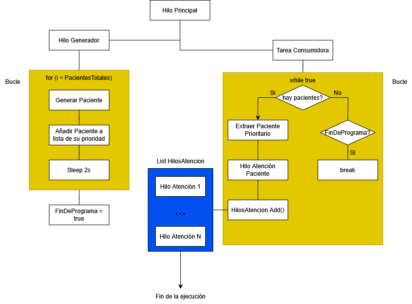
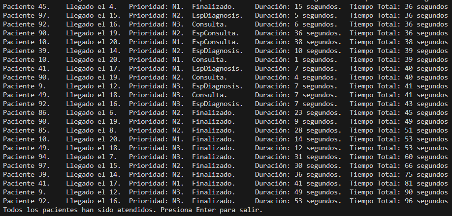

# Ejercicio 2 – Prioridades de los Pacientes – Tarea 4

## **Propósito del Proyecto**
Este proyecto simula un sistema hospitalario donde los pacientes son atendidos según su nivel de **prioridad** al llegar al hospital. Los pacientes se clasifican en tres niveles:
1. **Emergencias (Nivel 1):** Atendidos primero.
2. **Urgencias (Nivel 2):** Atendidos después de las emergencias.
3. **Consultas Generales (Nivel 3):** Atendidos al final.

El sistema asegura que los pacientes con mayor prioridad reciban atención primero y que, en caso de empate en la prioridad, se respete el **orden de llegada**.

---

## **Especificaciones del Código**

### **1. Atributos y Estados de los Pacientes:**
- **Prioridad:**
  - Asignada aleatoriamente en el rango de 1 a 3.
- **Estados del Paciente:**
  - *EsperaConsulta*: Esperando para ingresar a consulta médica.
  - *Consulta*: Atendido por un médico.
  - *EsperaDiagnostico*: En espera para usar una máquina de diagnóstico.
  - *Finalizado*: Ha completado la consulta y el diagnóstico (si era necesario).

### **2. Estructura Concurrente:**
- Se crean **tres colecciones concurrentes (`BlockingCollection`)**, una por cada nivel de prioridad. Esto permite almacenar y procesar a los pacientes según su prioridad:
  - `PacientesN1`: Pacientes de nivel 1 (Emergencias).
  - `PacientesN2`: Pacientes de nivel 2 (Urgencias).
  - `PacientesN3`: Pacientes de nivel 3 (Consultas Generales).
- Se utiliza un semáforo (`SemaphoreSlim`) para gestionar la concurrencia y asegurar el acceso controlado a los recursos médicos.

### **3. Flujo de Atención:**
1. **Hilo *generador* de Pacientes:**

 - Los pacientes se generan secuencialmente cada **2 segundos** y se asignan a la colección correspondiente a su prioridad.
2. **Tarea *consumidora* de Pacientes:**
 - Una tarea se encarga de extraer un paciente por orden de prioridad (Nivel 1, luego 2, y finalmente 3). Después, genera un hilo en el que se le pasará a consulta
   
3. **Hilo de Consulta y Diagnóstico:**
 - Los pacientes pasan primero a consulta. Si requieren diagnóstico, esperan su turno para usar una máquina.

---

## **Métodos y Clases Implementadas**

### **1. Método `GestionarLlegadas()`**
Genera pacientes y los asigna a la colección correspondiente a su nivel de prioridad:
```csharp
switch (paciente.Prioridad)
{
    case 1: // Emergencias
        PacientesN1.Add(paciente);
        break;
    case 2: // Urgencias
        PacientesN2.Add(paciente);
        break;
    case 3: // Consultas generales
        PacientesN3.Add(paciente);
        break;
}
SemAtencion.Release();
Thread.Sleep(2000);
```

### **2. Método `ExtraerPacientePrioritario()`**

Selecciona el paciente más prioritario disponible, comenzando por el Nivel 1:
```csharp
if (PacientesN1.Count > 0) return PacientesN1.Take();
else if (PacientesN2.Count > 0) return PacientesN2.Take();
else if (PacientesN3.Count > 0) return PacientesN3.Take();
```

### **3. Método `AtenderPaciente()`**
Procesa al paciente desde su ingreso a consulta hasta la finalización:
```csharp
OperarEstado(Estado.Consulta, paciente);
Thread.Sleep(paciente.TiempoConsulta * 1000);

if (paciente.RequiereDiagnostico)
{
    OperarEstado(Estado.EspDiagnosis, paciente);
    SemMedicos.Release();
    SemDiagnosis.Wait();
    Thread.Sleep(15000);
    SemDiagnosis.Release();
}

OperarEstado(Estado.Finalizado, paciente);
if (!paciente.RequiereDiagnostico) SemMedicos.Release();
```

### **4. Método `OperarEstado()`**
El método OperarEstado():
- Modifica el estado actual del paciente.
- Calcula el tiempo transcurrido desde el último estado.
- Actualiza el tiempo total acumulado del paciente.
- Muestra en consola la información detallada del paciente.

```csharp
private static void OperarEstado(Estado estado, Paciente paciente)
{
    paciente.Estado = estado;
    int CronoMain = (int) MainStopwatch.Elapsed.TotalSeconds;
    paciente.TiempoEstados = CronoMain - paciente.TiempoTotal;
    paciente.TiempoTotal = CronoMain;
    MostrarInformacion(paciente);
}
```

---

## **Preguntas y Respuestas**
### **1. Explica el planteamiento de tu código y por qué lo has escogido.**

Para manejar las prioridades, he creado tres colecciones concurrentes, una para cada nivel de prioridad. Esto asegura que los pacientes se procesen primero por prioridad y, dentro de la misma prioridad, por orden de llegada. Este enfoque optimiza el rendimiento evitando búsquedas frecuentes en una única lista de pacientes.

### **2. Plantea otra posibilidad de solución a la que has programado.**

Podría seguir funcionando con una única colección. Cuando un paciente llega, entonces
la tarea consumidora recorre la lista en busca del más prioritario. Sin embargo esto consumirá más CPU.
Otra solución que se valoró es la de crear una única lista concurrente. Llegado el momento de extraer un paciente, podría hacer una lista "secuencial" basada en la lista concurrente, ordenada por la prioridad de los pacientes y extraer así el más prioritario. Sin embargo, esta opción es menos óptima y más complicada de implementar.

---

## Diagrama de flujo
Debido a que el flujo de este programa cambia significativamente con respecto a los proyectos anteriores, se ha preparado este pequeño diagrama que muestra el flujo por el que pasa el programa:


---

## Ejemplo de Ejecución en Consola


Este es el output completo de una ejecución:
```bash
ID PACIENTE.    ORDEN LLEGADA.  PRIORIDAD.      ESTADO ACTUAL.  TRANSICION ESTADO.      TIEMPO TOTAL
Paciente 71.    Llegado el 1.   Prioridad: N2.  EspConsulta.    Duración: 0 segundos.   Tiempo Total: 0 segundos
Paciente 71.    Llegado el 1.   Prioridad: N2.  Consulta.       Duración: 0 segundos.   Tiempo Total: 0 segundos
Paciente 77.    Llegado el 2.   Prioridad: N2.  EspConsulta.    Duración: 2 segundos.   Tiempo Total: 2 segundos
Paciente 77.    Llegado el 2.   Prioridad: N2.  Consulta.       Duración: 0 segundos.   Tiempo Total: 2 segundos
Paciente 22.    Llegado el 3.   Prioridad: N2.  EspConsulta.    Duración: 4 segundos.   Tiempo Total: 4 segundos
Paciente 22.    Llegado el 3.   Prioridad: N2.  Consulta.       Duración: 0 segundos.   Tiempo Total: 4 segundos
Paciente 45.    Llegado el 4.   Prioridad: N1.  EspConsulta.    Duración: 6 segundos.   Tiempo Total: 6 segundos
Paciente 45.    Llegado el 4.   Prioridad: N1.  Consulta.       Duración: 0 segundos.   Tiempo Total: 6 segundos
Paciente 77.    Llegado el 2.   Prioridad: N2.  Finalizado.     Duración: 5 segundos.   Tiempo Total: 7 segundos
Paciente 89.    Llegado el 5.   Prioridad: N2.  EspConsulta.    Duración: 8 segundos.   Tiempo Total: 8 segundos
Paciente 89.    Llegado el 5.   Prioridad: N2.  Consulta.       Duración: 0 segundos.   Tiempo Total: 8 segundos
Paciente 86.    Llegado el 6.   Prioridad: N2.  EspConsulta.    Duración: 10 segundos.  Tiempo Total: 10 segundos
Paciente 94.    Llegado el 7.   Prioridad: N3.  EspConsulta.    Duración: 12 segundos.  Tiempo Total: 12 segundos
Paciente 85.    Llegado el 8.   Prioridad: N2.  EspConsulta.    Duración: 14 segundos.  Tiempo Total: 14 segundos
Paciente 71.    Llegado el 1.   Prioridad: N2.  Finalizado.     Duración: 15 segundos.  Tiempo Total: 15 segundos
Paciente 86.    Llegado el 6.   Prioridad: N2.  Consulta.       Duración: 5 segundos.   Tiempo Total: 15 segundos
Paciente 22.    Llegado el 3.   Prioridad: N2.  EspDiagnosis.   Duración: 11 segundos.  Tiempo Total: 15 segundos
Paciente 85.    Llegado el 8.   Prioridad: N2.  Consulta.       Duración: 1 segundos.   Tiempo Total: 15 segundos
Paciente 87.    Llegado el 9.   Prioridad: N3.  EspConsulta.    Duración: 16 segundos.  Tiempo Total: 16 segundos
Paciente 78.    Llegado el 10.  Prioridad: N2.  EspConsulta.    Duración: 18 segundos.  Tiempo Total: 18 segundos
Paciente 57.    Llegado el 11.  Prioridad: N3.  EspConsulta.    Duración: 20 segundos.  Tiempo Total: 20 segundos
Paciente 45.    Llegado el 4.   Prioridad: N1.  EspDiagnosis.   Duración: 15 segundos.  Tiempo Total: 21 segundos
Paciente 78.    Llegado el 10.  Prioridad: N2.  Consulta.       Duración: 3 segundos.   Tiempo Total: 21 segundos
Paciente 86.    Llegado el 6.   Prioridad: N2.  EspDiagnosis.   Duración: 7 segundos.   Tiempo Total: 22 segundos
Paciente 94.    Llegado el 7.   Prioridad: N3.  Consulta.       Duración: 10 segundos.  Tiempo Total: 22 segundos
Paciente 9.     Llegado el 12.  Prioridad: N3.  EspConsulta.    Duración: 22 segundos.  Tiempo Total: 22 segundos
Paciente 89.    Llegado el 5.   Prioridad: N2.  Finalizado.     Duración: 15 segundos.  Tiempo Total: 23 segundos
Paciente 85.    Llegado el 8.   Prioridad: N2.  EspDiagnosis.   Duración: 8 segundos.   Tiempo Total: 23 segundos
Paciente 87.    Llegado el 9.   Prioridad: N3.  Consulta.       Duración: 7 segundos.   Tiempo Total: 23 segundos
Paciente 57.    Llegado el 11.  Prioridad: N3.  Consulta.       Duración: 3 segundos.   Tiempo Total: 23 segundos
Paciente 56.    Llegado el 13.  Prioridad: N1.  EspConsulta.    Duración: 24 segundos.  Tiempo Total: 24 segundos
Paciente 39.    Llegado el 14.  Prioridad: N2.  EspConsulta.    Duración: 26 segundos.  Tiempo Total: 26 segundos
Paciente 97.    Llegado el 15.  Prioridad: N2.  EspConsulta.    Duración: 28 segundos.  Tiempo Total: 28 segundos
Paciente 94.    Llegado el 7.   Prioridad: N3.  EspDiagnosis.   Duración: 7 segundos.   Tiempo Total: 29 segundos
Paciente 56.    Llegado el 13.  Prioridad: N1.  Consulta.       Duración: 5 segundos.   Tiempo Total: 29 segundos
Paciente 78.    Llegado el 10.  Prioridad: N2.  Finalizado.     Duración: 8 segundos.   Tiempo Total: 29 segundos
Paciente 39.    Llegado el 14.  Prioridad: N2.  Consulta.       Duración: 3 segundos.   Tiempo Total: 29 segundos
Paciente 22.    Llegado el 3.   Prioridad: N2.  Finalizado.     Duración: 15 segundos.  Tiempo Total: 30 segundos
Paciente 92.    Llegado el 16.  Prioridad: N3.  EspConsulta.    Duración: 30 segundos.  Tiempo Total: 30 segundos
Paciente 57.    Llegado el 11.  Prioridad: N3.  Finalizado.     Duración: 8 segundos.   Tiempo Total: 31 segundos
Paciente 97.    Llegado el 15.  Prioridad: N2.  Consulta.       Duración: 3 segundos.   Tiempo Total: 31 segundos
Paciente 41.    Llegado el 17.  Prioridad: N1.  EspConsulta.    Duración: 32 segundos.  Tiempo Total: 32 segundos
Paciente 87.    Llegado el 9.   Prioridad: N3.  Finalizado.     Duración: 10 segundos.  Tiempo Total: 33 segundos
Paciente 41.    Llegado el 17.  Prioridad: N1.  Consulta.       Duración: 1 segundos.   Tiempo Total: 33 segundos
Paciente 56.    Llegado el 13.  Prioridad: N1.  Finalizado.     Duración: 5 segundos.   Tiempo Total: 34 segundos
Paciente 9.     Llegado el 12.  Prioridad: N3.  Consulta.       Duración: 12 segundos.  Tiempo Total: 34 segundos
Paciente 49.    Llegado el 18.  Prioridad: N3.  EspConsulta.    Duración: 34 segundos.  Tiempo Total: 34 segundos
Paciente 45.    Llegado el 4.   Prioridad: N1.  Finalizado.     Duración: 15 segundos.  Tiempo Total: 36 segundos
Paciente 97.    Llegado el 15.  Prioridad: N2.  EspDiagnosis.   Duración: 5 segundos.   Tiempo Total: 36 segundos
Paciente 92.    Llegado el 16.  Prioridad: N3.  Consulta.       Duración: 6 segundos.   Tiempo Total: 36 segundos
Paciente 90.    Llegado el 19.  Prioridad: N2.  EspConsulta.    Duración: 36 segundos.  Tiempo Total: 36 segundos
Paciente 10.    Llegado el 20.  Prioridad: N1.  EspConsulta.    Duración: 38 segundos.  Tiempo Total: 38 segundos
Paciente 39.    Llegado el 14.  Prioridad: N2.  EspDiagnosis.   Duración: 10 segundos.  Tiempo Total: 39 segundos
Paciente 10.    Llegado el 20.  Prioridad: N1.  Consulta.       Duración: 1 segundos.   Tiempo Total: 39 segundos
Paciente 41.    Llegado el 17.  Prioridad: N1.  EspDiagnosis.   Duración: 7 segundos.   Tiempo Total: 40 segundos
Paciente 90.    Llegado el 19.  Prioridad: N2.  Consulta.       Duración: 4 segundos.   Tiempo Total: 40 segundos
Paciente 9.     Llegado el 12.  Prioridad: N3.  EspDiagnosis.   Duración: 7 segundos.   Tiempo Total: 41 segundos
Paciente 49.    Llegado el 18.  Prioridad: N3.  Consulta.       Duración: 7 segundos.   Tiempo Total: 41 segundos
Paciente 92.    Llegado el 16.  Prioridad: N3.  EspDiagnosis.   Duración: 7 segundos.   Tiempo Total: 43 segundos
Paciente 86.    Llegado el 6.   Prioridad: N2.  Finalizado.     Duración: 23 segundos.  Tiempo Total: 45 segundos
Paciente 90.    Llegado el 19.  Prioridad: N2.  Finalizado.     Duración: 9 segundos.   Tiempo Total: 49 segundos
Paciente 85.    Llegado el 8.   Prioridad: N2.  Finalizado.     Duración: 28 segundos.  Tiempo Total: 51 segundos
Paciente 10.    Llegado el 20.  Prioridad: N1.  Finalizado.     Duración: 14 segundos.  Tiempo Total: 53 segundos
Paciente 49.    Llegado el 18.  Prioridad: N3.  Finalizado.     Duración: 12 segundos.  Tiempo Total: 53 segundos
Paciente 94.    Llegado el 7.   Prioridad: N3.  Finalizado.     Duración: 31 segundos.  Tiempo Total: 60 segundos
Paciente 97.    Llegado el 15.  Prioridad: N2.  Finalizado.     Duración: 30 segundos.  Tiempo Total: 66 segundos
Paciente 39.    Llegado el 14.  Prioridad: N2.  Finalizado.     Duración: 36 segundos.  Tiempo Total: 75 segundos
Paciente 41.    Llegado el 17.  Prioridad: N1.  Finalizado.     Duración: 41 segundos.  Tiempo Total: 81 segundos
Paciente 9.     Llegado el 12.  Prioridad: N3.  Finalizado.     Duración: 49 segundos.  Tiempo Total: 90 segundos
Paciente 92.    Llegado el 16.  Prioridad: N3.  Finalizado.     Duración: 53 segundos.  Tiempo Total: 96 segundos
Todos los pacientes han sido atendidos. Presiona Enter para salir.
```