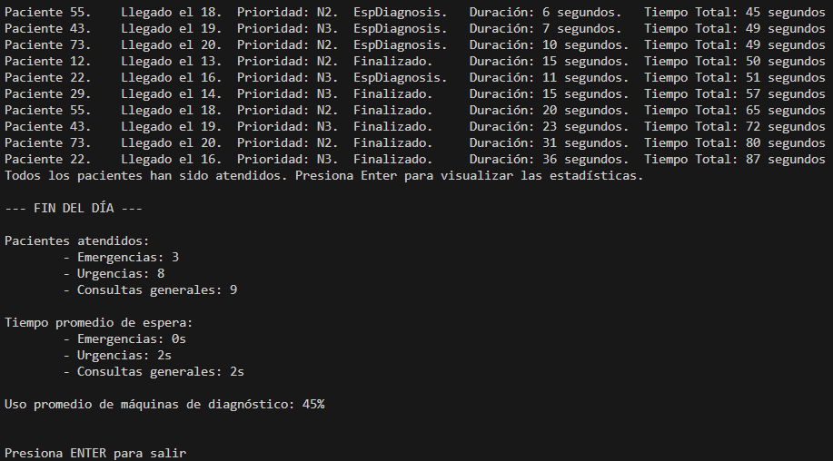

# Ejercicio 2 – Estadísticas y Logs – Tarea 5

## **Propósito del Proyecto**
Este proyecto amplía la simulación hospitalaria previa, añadiendo una funcionalidad para calcular **estadísticas al finalizar la simulación**. El sistema analiza y presenta los siguientes datos:
- Número total de pacientes atendidos por nivel de prioridad.
- Tiempo promedio de espera por paciente según su nivel de prioridad.
- Uso promedio de las máquinas de diagnóstico.

---

## **Especificaciones del Código**

### **1. Estadísticas Generadas:**
- **Pacientes Atendidos:**  
  - Clasificados por prioridad (*Emergencias*, *Urgencias* y *Consultas Generales*).
- **Tiempo Promedio de Espera:**  
  - Calculado como la suma de los tiempos de espera de todos los pacientes dividida entre el número de pacientes atendidos por prioridad.
- **Uso Promedio de Máquinas de Diagnóstico:**  
  - Representa el porcentaje de pacientes que utilizaron las máquinas.

### **2. Variables Globales Utilizadas:**
- `PacientesAtendidos`: Array de enteros donde cada índice corresponde al número de pacientes atendidos según su prioridad.
- `TiemposEspera`: Array de enteros que acumula los tiempos de espera por prioridad.
- `PacientesDiagnosticados`: Entero que registra la cantidad de pacientes que utilizaron las máquinas de diagnóstico.

### **3. Flujo de Simulación:**
1. **Pacientes Generados:**
   - Un hilo genera los pacientes secuencialmente, asignándolos a la lista correspondiente a su prioridad.
2. **Gestión de Estadísticas:**
   - Los tiempos de espera y pacientes atendidos se registran mientras los pacientes pasan por las etapas de consulta y diagnóstico.
3. **Finalización:**
   - Una vez todos los pacientes son atendidos, se calculan las estadísticas y se presentan al usuario.

---

## **Uso de las Variables Globales**
En esta tarea, las clases y funciones utilizadas son en esencia las mismas que en el proyecto de la tarea anterior. Por eso, en este apartado se detalla cómo se modifican las variables globales en el transcurso del código para obtener las estadísticas requeridas.

### **1. Variable `PacientesAtendidos`**
Dentro del método `GestionarLlegadas()`, se suma 1 al valor que contenga cada índice correspondiente a la prioridad del paciente:
```csharp
switch (paciente.Prioridad)
{
    case 1:
        PacientesN1.Add(paciente);
        lock(locker)
        {
            PacientesAtendidos[0]++; // +1 si el paciente es emergente
        }
        break;

    case 2:
        PacientesN2.Add(paciente);
        lock(locker)
        {
            PacientesAtendidos[1]++; // +1 si el paciente es urgente
        }
        break;

    case 3:
        PacientesN3.Add(paciente);
        lock(locker)
        {
            PacientesAtendidos[2]++; // +1 si el paciente es general
        }
        break;
}
SemAtencion.Release();
Thread.Sleep(2000);
```

### **2. Variable `TiemposEspera`**

Dentro del método `OperarEstado()`, se suman los tiempos de espera:
```csharp
private static void OperarEstado(Estado estado, Paciente paciente)
{
    paciente.Estado = estado;
    int CronoMain = (int) MainStopwatch.Elapsed.TotalSeconds;
    paciente.TiempoEstados = CronoMain - paciente.TiempoTotal;
    paciente.TiempoTotal = CronoMain;
    MostrarInformacion(paciente);

    if (estado == Estado.Consulta)
    {
        switch (paciente.Prioridad)
        {
            case 1:
                lock(locker)
                {
                    TiemposEspera[0] += paciente.TiempoEstados;
                }
                break;

            case 2:
                lock(locker)
                {
                    TiemposEspera[1] += paciente.TiempoEstados;
                }
                break;

            case 3:
                lock(locker)
                {
                    TiemposEspera[2] += paciente.TiempoEstados;
                }
                break;
        }
    }
}
```

### **3. Variable `PacientesDiagnosticados`**
Dentro del método `AtenderPaciente()`:
```csharp
if(paciente.RequiereDiagnostico)
{
	OperarEstado(Estado.EspDiagnosis, paciente);
	SemMedicos.Release();
	SemDiagnosis.Wait();
	Thread.Sleep(15000);
	SemDiagnosis.Release();
	lock(locker) PacientesDiagnosticados++;
}
```

### **4. Método `MostrarStats()`**

Calcula y presenta las estadísticas finales:
```csharp
private static void MostrarStats()
{
    Console.WriteLine("--- FIN DEL DÍA ---");

    Console.WriteLine("\nPacientes atendidos: ");
    Console.WriteLine("\t- Emergencias: {0}\n\t- Urgencias: {1}\n\t- Consultas generales: {2}",
        PacientesAtendidos[0], PacientesAtendidos[1], PacientesAtendidos[2]);
    
    Console.WriteLine("\nTiempo promedio de espera: ");
    Console.WriteLine("\t- Emergencias: {0}s\n\t- Urgencias: {1}s\n\t- Consultas generales: {2}s",
        TiemposEspera[0] / PacientesAtendidos[0], 
        TiemposEspera[1] / PacientesAtendidos[1], 
        TiemposEspera[2] / PacientesAtendidos[2]);

    Console.WriteLine("\nUso promedio de máquinas de diagnóstico: {0}%", ((PacientesDiagnosticados * 100) / PacientesTotales));

    Console.WriteLine("\n\nPresiona ENTER para salir");
    Console.ReadLine();
}
```
Es importante apreciar aquí la forma en la que se calcula el uso promedio de las máquinas de diagnóstico.
Un calculo normal podría hacerse de la siguiente manera: **(`PacientesDiagnosticados`  / `PacientesTotales` * 100)**. Ahora bien, al trabajar con enteros la división entre `PacientesDiagnosticados`  y `PacientesTotales` siempre dará `int 0`, valor que al multiplicar por 100 volverá a devolver 0.

---

# **Preguntas y Respuestas**
##**1. ¿Puedes explicar tu código y por qué has decidido hacerlo así?**

He utilizado tres variables globales (`PacientesAtendidos`, `TiemposEspera` y `PacientesDiagnosticados`) para registrar las estadísticas durante la ejecución:
- Esta estructura permite recopilar los datos de forma segura y eficiente usando bloqueos (`lock`).
- La lógica implementada asegura que las estadísticas sean precisas y se calculen automáticamente al finalizar la simulación.

Esta solución fue seleccionada por su simplicidad, seguridad y escalabilidad, siendo fácil de implementar y mantener en comparación con alternativas más complejas.

## **2. ¿Plantea otra posibilidad de solución a la que has programado?**

Otra opción sería calcular las estadísticas al final del programa iterando sobre los pacientes atendidos. Sin embargo, esto añadiría una etapa de procesamiento adicional, incrementando la carga computacional. La solución actual optimiza el proceso al recopilar los datos en tiempo real.

---

# Ejemplo de Ejecución en Consola


Este es el output completo de una ejecución:
```bash
ID PACIENTE.    ORDEN LLEGADA.  PRIORIDAD.      ESTADO ACTUAL.  TRANSICION ESTADO.      TIEMPO TOTAL
Paciente 18.    Llegado el 1.   Prioridad: N2.  EspConsulta.    Duración: 0 segundos.   Tiempo Total: 0 segundos
Paciente 18.    Llegado el 1.   Prioridad: N2.  Consulta.       Duración: 0 segundos.   Tiempo Total: 0 segundos
Paciente 81.    Llegado el 2.   Prioridad: N1.  EspConsulta.    Duración: 2 segundos.   Tiempo Total: 2 segundos
Paciente 81.    Llegado el 2.   Prioridad: N1.  Consulta.       Duración: 0 segundos.   Tiempo Total: 2 segundos
Paciente 71.    Llegado el 3.   Prioridad: N1.  EspConsulta.    Duración: 4 segundos.   Tiempo Total: 4 segundos
Paciente 71.    Llegado el 3.   Prioridad: N1.  Consulta.       Duración: 0 segundos.   Tiempo Total: 4 segundos
Paciente 11.    Llegado el 4.   Prioridad: N3.  EspConsulta.    Duración: 6 segundos.   Tiempo Total: 6 segundos
Paciente 11.    Llegado el 4.   Prioridad: N3.  Consulta.       Duración: 0 segundos.   Tiempo Total: 6 segundos
Paciente 19.    Llegado el 5.   Prioridad: N2.  EspConsulta.    Duración: 8 segundos.   Tiempo Total: 8 segundos
Paciente 81.    Llegado el 2.   Prioridad: N1.  Finalizado.     Duración: 7 segundos.   Tiempo Total: 9 segundos
Paciente 19.    Llegado el 5.   Prioridad: N2.  Consulta.       Duración: 1 segundos.   Tiempo Total: 9 segundos
Paciente 71.    Llegado el 3.   Prioridad: N1.  Finalizado.     Duración: 6 segundos.   Tiempo Total: 10 segundos
Paciente 96.    Llegado el 6.   Prioridad: N1.  EspConsulta.    Duración: 10 segundos.  Tiempo Total: 10 segundos
Paciente 96.    Llegado el 6.   Prioridad: N1.  Consulta.       Duración: 0 segundos.   Tiempo Total: 10 segundos
Paciente 11.    Llegado el 4.   Prioridad: N3.  EspDiagnosis.   Duración: 5 segundos.   Tiempo Total: 11 segundos
Paciente 31.    Llegado el 7.   Prioridad: N3.  EspConsulta.    Duración: 12 segundos.  Tiempo Total: 12 segundos
Paciente 31.    Llegado el 7.   Prioridad: N3.  Consulta.       Duración: 0 segundos.   Tiempo Total: 12 segundos
Paciente 18.    Llegado el 1.   Prioridad: N2.  EspDiagnosis.   Duración: 13 segundos.  Tiempo Total: 13 segundos
Paciente 61.    Llegado el 8.   Prioridad: N3.  EspConsulta.    Duración: 14 segundos.  Tiempo Total: 14 segundos
Paciente 61.    Llegado el 8.   Prioridad: N3.  Consulta.       Duración: 0 segundos.   Tiempo Total: 14 segundos
Paciente 13.    Llegado el 9.   Prioridad: N3.  EspConsulta.    Duración: 16 segundos.  Tiempo Total: 16 segundos
Paciente 31.    Llegado el 7.   Prioridad: N3.  Finalizado.     Duración: 5 segundos.   Tiempo Total: 17 segundos
Paciente 13.    Llegado el 9.   Prioridad: N3.  Consulta.       Duración: 1 segundos.   Tiempo Total: 17 segundos
Paciente 10.    Llegado el 10.  Prioridad: N3.  EspConsulta.    Duración: 18 segundos.  Tiempo Total: 18 segundos
Paciente 19.    Llegado el 5.   Prioridad: N2.  EspDiagnosis.   Duración: 11 segundos.  Tiempo Total: 20 segundos
Paciente 10.    Llegado el 10.  Prioridad: N3.  Consulta.       Duración: 2 segundos.   Tiempo Total: 20 segundos
Paciente 96.    Llegado el 6.   Prioridad: N1.  Finalizado.     Duración: 10 segundos.  Tiempo Total: 20 segundos
Paciente 16.    Llegado el 11.  Prioridad: N2.  EspConsulta.    Duración: 20 segundos.  Tiempo Total: 20 segundos
Paciente 16.    Llegado el 11.  Prioridad: N2.  Consulta.       Duración: 0 segundos.   Tiempo Total: 20 segundos
Paciente 14.    Llegado el 12.  Prioridad: N2.  EspConsulta.    Duración: 22 segundos.  Tiempo Total: 22 segundos
Paciente 12.    Llegado el 13.  Prioridad: N2.  EspConsulta.    Duración: 24 segundos.  Tiempo Total: 24 segundos
Paciente 11.    Llegado el 4.   Prioridad: N3.  Finalizado.     Duración: 15 segundos.  Tiempo Total: 26 segundos
Paciente 29.    Llegado el 14.  Prioridad: N3.  EspConsulta.    Duración: 26 segundos.  Tiempo Total: 26 segundos
Paciente 10.    Llegado el 10.  Prioridad: N3.  Finalizado.     Duración: 7 segundos.   Tiempo Total: 27 segundos
Paciente 14.    Llegado el 12.  Prioridad: N2.  Consulta.       Duración: 5 segundos.   Tiempo Total: 27 segundos
Paciente 18.    Llegado el 1.   Prioridad: N2.  Finalizado.     Duración: 15 segundos.  Tiempo Total: 28 segundos
Paciente 16.    Llegado el 11.  Prioridad: N2.  Finalizado.     Duración: 8 segundos.   Tiempo Total: 28 segundos
Paciente 12.    Llegado el 13.  Prioridad: N2.  Consulta.       Duración: 4 segundos.   Tiempo Total: 28 segundos
Paciente 57.    Llegado el 15.  Prioridad: N3.  EspConsulta.    Duración: 28 segundos.  Tiempo Total: 28 segundos
Paciente 61.    Llegado el 8.   Prioridad: N3.  Finalizado.     Duración: 15 segundos.  Tiempo Total: 29 segundos
Paciente 29.    Llegado el 14.  Prioridad: N3.  Consulta.       Duración: 3 segundos.   Tiempo Total: 29 segundos
Paciente 22.    Llegado el 16.  Prioridad: N3.  EspConsulta.    Duración: 30 segundos.  Tiempo Total: 30 segundos
Paciente 13.    Llegado el 9.   Prioridad: N3.  Finalizado.     Duración: 14 segundos.  Tiempo Total: 31 segundos
Paciente 57.    Llegado el 15.  Prioridad: N3.  Consulta.       Duración: 3 segundos.   Tiempo Total: 31 segundos
Paciente 66.    Llegado el 17.  Prioridad: N2.  EspConsulta.    Duración: 32 segundos.  Tiempo Total: 32 segundos
Paciente 55.    Llegado el 18.  Prioridad: N2.  EspConsulta.    Duración: 34 segundos.  Tiempo Total: 34 segundos
Paciente 12.    Llegado el 13.  Prioridad: N2.  EspDiagnosis.   Duración: 7 segundos.   Tiempo Total: 35 segundos
Paciente 66.    Llegado el 17.  Prioridad: N2.  Consulta.       Duración: 3 segundos.   Tiempo Total: 35 segundos
Paciente 43.    Llegado el 19.  Prioridad: N3.  EspConsulta.    Duración: 36 segundos.  Tiempo Total: 36 segundos
Paciente 73.    Llegado el 20.  Prioridad: N2.  EspConsulta.    Duración: 38 segundos.  Tiempo Total: 38 segundos
Paciente 14.    Llegado el 12.  Prioridad: N2.  Finalizado.     Duración: 12 segundos.  Tiempo Total: 39 segundos
Paciente 55.    Llegado el 18.  Prioridad: N2.  Consulta.       Duración: 5 segundos.   Tiempo Total: 39 segundos
Paciente 57.    Llegado el 15.  Prioridad: N3.  Finalizado.     Duración: 8 segundos.   Tiempo Total: 39 segundos
Paciente 73.    Llegado el 20.  Prioridad: N2.  Consulta.       Duración: 1 segundos.   Tiempo Total: 39 segundos
Paciente 66.    Llegado el 17.  Prioridad: N2.  Finalizado.     Duración: 5 segundos.   Tiempo Total: 40 segundos
Paciente 22.    Llegado el 16.  Prioridad: N3.  Consulta.       Duración: 10 segundos.  Tiempo Total: 40 segundos
Paciente 19.    Llegado el 5.   Prioridad: N2.  Finalizado.     Duración: 21 segundos.  Tiempo Total: 41 segundos
Paciente 29.    Llegado el 14.  Prioridad: N3.  EspDiagnosis.   Duración: 13 segundos.  Tiempo Total: 42 segundos
Paciente 43.    Llegado el 19.  Prioridad: N3.  Consulta.       Duración: 6 segundos.   Tiempo Total: 42 segundos
Paciente 55.    Llegado el 18.  Prioridad: N2.  EspDiagnosis.   Duración: 6 segundos.   Tiempo Total: 45 segundos
Paciente 43.    Llegado el 19.  Prioridad: N3.  EspDiagnosis.   Duración: 7 segundos.   Tiempo Total: 49 segundos
Paciente 73.    Llegado el 20.  Prioridad: N2.  EspDiagnosis.   Duración: 10 segundos.  Tiempo Total: 49 segundos
Paciente 12.    Llegado el 13.  Prioridad: N2.  Finalizado.     Duración: 15 segundos.  Tiempo Total: 50 segundos
Paciente 22.    Llegado el 16.  Prioridad: N3.  EspDiagnosis.   Duración: 11 segundos.  Tiempo Total: 51 segundos
Paciente 29.    Llegado el 14.  Prioridad: N3.  Finalizado.     Duración: 15 segundos.  Tiempo Total: 57 segundos
Paciente 55.    Llegado el 18.  Prioridad: N2.  Finalizado.     Duración: 20 segundos.  Tiempo Total: 65 segundos
Paciente 43.    Llegado el 19.  Prioridad: N3.  Finalizado.     Duración: 23 segundos.  Tiempo Total: 72 segundos
Paciente 73.    Llegado el 20.  Prioridad: N2.  Finalizado.     Duración: 31 segundos.  Tiempo Total: 80 segundos
Paciente 22.    Llegado el 16.  Prioridad: N3.  Finalizado.     Duración: 36 segundos.  Tiempo Total: 87 segundos
Todos los pacientes han sido atendidos. Presiona Enter para visualizar las estadísticas.

--- FIN DEL DÍA ---

Pacientes atendidos:
        - Emergencias: 3
        - Urgencias: 8
        - Consultas generales: 9

Tiempo promedio de espera:
        - Emergencias: 0s
        - Urgencias: 2s
        - Consultas generales: 2s

Uso promedio de máquinas de diagnóstico: 45%


Presiona ENTER para salir
```