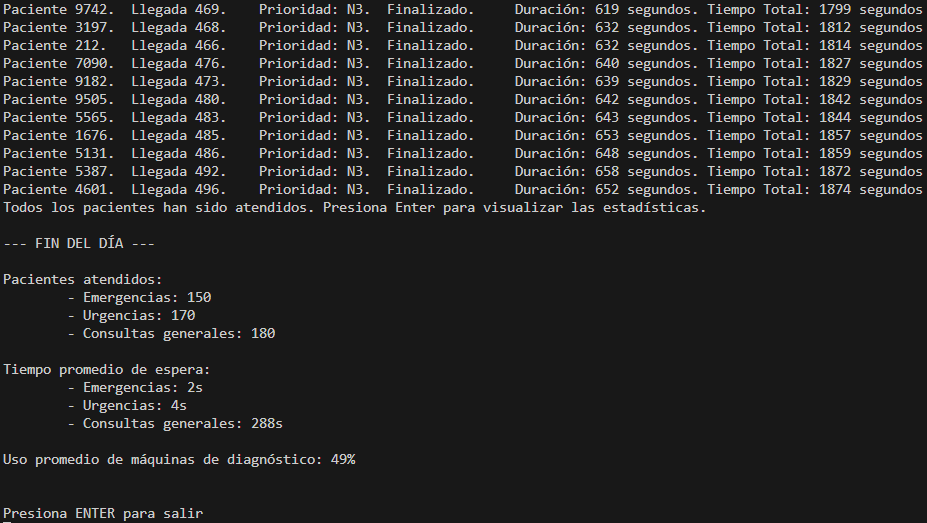

# Ejercicio 3 – Pacientes Infinitos – Tarea 1

## **Propósito del Proyecto**
Este ejercicio simula un hospital con un **generador dinámico de pacientes**. Los pacientes se generan de manera infinita (hasta que se detenga el programa) o para un número predefinido de pacientes. Cada paciente cuenta con atributos únicos y pasa por un flujo de consulta médica y diagnóstico si es necesario.

Además, el programa evalúa el comportamiento y la escalabilidad al aumentar la cantidad de pacientes (por ejemplo, N = 50, 100, 1000).

---

## **Especificaciones del Código**

### **1. Generador de Pacientes**
- Un hilo genera pacientes cada **2 segundos**, asignándoles atributos aleatorios:
  - **Prioridad:**  
    1. Emergencias.  
    2. Urgencias.  
    3. Consultas Generales.
  - **Tiempo de consulta:** Valor aleatorio entre 5 y 15 segundos.
  - **Diagnóstico:** Se asigna aleatoriamente si el paciente requiere pasar por máquina.
- Los pacientes son almacenados en una de las tres listas concurrentes (`BlockingCollection`), según su prioridad.

### **2. Problemas Detectados**
#### Tarea 1 – Cumplimiento de Requisitos:
- Cuando **N ≤ 100**, el sistema funciona correctamente.
- Cuando **N > 100**, el programa incumple los requisitos de IDs únicos debido a la limitación inicial del rango de IDs (1 a 100). Esto causa que hilos queden bloqueados esperando un ID no disponible.

#### Tarea 2 – Comportamientos No Previstos:
- Solución aplicada:
  - Se incrementó el rango de IDs a **1 a 10,000**, eliminando el bloqueo para pacientes >100.
  - Se ajustaron los formatos de salida para que sean claros y legibles incluso con un alto volumen de datos.

### **3. Flujo del Programa**
1. **Generación Dinámica:**
   - Cada nuevo paciente se genera en el método `GestionarLlegadas`.
   - Se asigna a la cola de su prioridad correspondiente.
2. **Atención por Prioridad y Llegada:**
   - Los pacientes son atendidos por orden de prioridad y, en caso de empate, por orden de llegada.
3. **Consulta y Diagnóstico:**
   - Hasta 4 consultas pueden ocurrir simultáneamente.
   - 2 máquinas de diagnóstico gestionan los pacientes que lo requieren.

---

## **Métodos y Clases Modificadas**

### **1. Método `IdAleatorio()`**
Corregido para que genere un ID entre 1 y 10.000:
```csharp
private static int IdAleatorio()
{
	bool disponible = false;
	int id = 0;
	while(!disponible)
	{
		disponible = true;
		id = NumAleatorio(1,10000);
		Parallel.ForEach (IntercambioIds, Identificador => {
			if (Identificador == id) disponible = false;
		});
	}
	IntercambioIds.Add(id);
	return id;
}
```

### **2. Método `MostrarInformacion()`**
Corregido para ofrecer un output más legible:
```csharp
private static void MostrarInformacion (Paciente paciente)
{
	Console.WriteLine("Paciente {0}. \tLlegada {1}. \tPrioridad: N{2}. \t{3}. \tDuración: {4} segundos.\tTiempo Total: {5} segundos",
		paciente.Id, paciente.NumeroLlegada, paciente.Prioridad, paciente.Estado, paciente.TiempoEstados, paciente.TiempoTotal);
}
```

---

# Preguntas y Respuestas
## **Tarea 1: ¿Cumple con los requisitos?**
El programa cumple con los requisitos cuando N ≤ 100. Al superar los 100 pacientes, se generan bloqueos debido a la limitación inicial del rango de IDs. Sin embargo, este problema fue solucionado ampliando el rango de IDs a 1 a 10,000, lo que garantiza unicidad incluso para un número elevado de pacientes.

## **Tarea 2: ¿Qué comportamientos no previstos detectas?**
- Se detectó que los IDs no eran únicos para N > 100, lo cual fue corregido.
- Los outputs no encajaban con un formato claro. Esto fue adaptado para asegurar claridad con un alto volumen de pacientes.

## Tarea 3: ¿Cómo adaptarías tu solución?
- IDs únicos: Incrementar el rango de IDs a 1-10,000 elimina bloqueos y asegura unicidad.
- Salidas claras: Mejorar los formatos de salida para facilitar la comprensión, incluso con grandes volúmenes de pacientes.
- Este enfoque asegura la escalabilidad del sistema y mantiene el orden de prioridad y llegada.

---

# Ejemplo de Ejecución en Consola
Se ha hecho una ejecución de 500 pacientes. En esta sección se puede observar una imagen de la consola y el output del programa. No se puede proporcionar el output completo pues el programa genera más líneas de las que el historial de la consola puede conservar.


```bash
Paciente 9649.  Llegada 411.    Prioridad: N3.  Finalizado.     Duración: 575 segundos. Tiempo Total: 1709 segundos
Paciente 9375.  Llegada 420.    Prioridad: N3.  Finalizado.     Duración: 584 segundos. Tiempo Total: 1722 segundos
Paciente 3770.  Llegada 430.    Prioridad: N3.  Finalizado.     Duración: 584 segundos. Tiempo Total: 1724 segundos
Paciente 9778.  Llegada 421.    Prioridad: N3.  Finalizado.     Duración: 592 segundos. Tiempo Total: 1737 segundos
Paciente 9208.  Llegada 444.    Prioridad: N3.  Finalizado.     Duración: 588 segundos. Tiempo Total: 1739 segundos
Paciente 9118.  Llegada 445.    Prioridad: N3.  Finalizado.     Duración: 599 segundos. Tiempo Total: 1752 segundos
Paciente 6706.  Llegada 442.    Prioridad: N3.  Finalizado.     Duración: 601 segundos. Tiempo Total: 1754 segundos
Paciente 2460.  Llegada 454.    Prioridad: N3.  Finalizado.     Duración: 609 segundos. Tiempo Total: 1767 segundos
Paciente 8550.  Llegada 452.    Prioridad: N3.  Finalizado.     Duración: 610 segundos. Tiempo Total: 1769 segundos
Paciente 6166.  Llegada 448.    Prioridad: N3.  Finalizado.     Duración: 622 segundos. Tiempo Total: 1782 segundos
Paciente 4657.  Llegada 457.    Prioridad: N3.  Finalizado.     Duración: 618 segundos. Tiempo Total: 1784 segundos
Paciente 8769.  Llegada 464.    Prioridad: N3.  Finalizado.     Duración: 621 segundos. Tiempo Total: 1797 segundos
Paciente 9742.  Llegada 469.    Prioridad: N3.  Finalizado.     Duración: 619 segundos. Tiempo Total: 1799 segundos
Paciente 3197.  Llegada 468.    Prioridad: N3.  Finalizado.     Duración: 632 segundos. Tiempo Total: 1812 segundos
Paciente 212.   Llegada 466.    Prioridad: N3.  Finalizado.     Duración: 632 segundos. Tiempo Total: 1814 segundos
Paciente 7090.  Llegada 476.    Prioridad: N3.  Finalizado.     Duración: 640 segundos. Tiempo Total: 1827 segundos
Paciente 9182.  Llegada 473.    Prioridad: N3.  Finalizado.     Duración: 639 segundos. Tiempo Total: 1829 segundos
Paciente 9505.  Llegada 480.    Prioridad: N3.  Finalizado.     Duración: 642 segundos. Tiempo Total: 1842 segundos
Paciente 5565.  Llegada 483.    Prioridad: N3.  Finalizado.     Duración: 643 segundos. Tiempo Total: 1844 segundos
Paciente 1676.  Llegada 485.    Prioridad: N3.  Finalizado.     Duración: 653 segundos. Tiempo Total: 1857 segundos
Paciente 5131.  Llegada 486.    Prioridad: N3.  Finalizado.     Duración: 648 segundos. Tiempo Total: 1859 segundos
Paciente 5387.  Llegada 492.    Prioridad: N3.  Finalizado.     Duración: 658 segundos. Tiempo Total: 1872 segundos
Paciente 4601.  Llegada 496.    Prioridad: N3.  Finalizado.     Duración: 652 segundos. Tiempo Total: 1874 segundos
Todos los pacientes han sido atendidos. Presiona Enter para visualizar las estadísticas.

--- FIN DEL DÍA ---

Pacientes atendidos:
        - Emergencias: 150
        - Urgencias: 170
        - Consultas generales: 180

Tiempo promedio de espera:
        - Emergencias: 2s
        - Urgencias: 4s
        - Consultas generales: 288s

Uso promedio de máquinas de diagnóstico: 49%


Presiona ENTER para salir
```